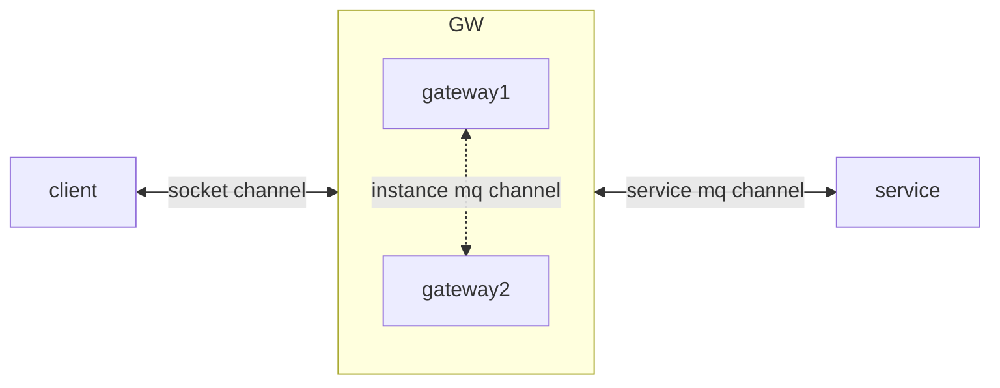

# WebSocket 网关

目录
=================
* [业务中的应用场景](#业务中的应用场景)
* [目前项目实现的预期性能及改进方向](#目前项目实现的预期性能及改进方向)
* [WebSocket 网关的技术实现方案及优缺点](#websocket-网关的技术实现方案及优缺点)
  * [用户多开](#用户多开)
    * [方案一](#方案一)
    * [方案二](#方案二)
  * [无损上线](#无损上线)
  * [精准投递](#精准投递)
    * [方案一：广播](#方案一广播)
    * [方案二：二次投递](#方案二二次投递)
* [WebSocket 网关设计](#websocket-网关设计)
  * [前后端交互协议](#前后端交互协议)
  * [网关和服务端交互协议](#网关和服务端交互协议)
  * [网关队列设计](#网关队列设计)
  * [网关监控设计](#网关监控设计)


# 业务中的应用场景
- IM通信
- 用户消息提示
- 耗时任务同步转异步，需要配合消息提示服务，可以提供消息卡片

# 目前项目实现的预期性能及改进方向
1. 单实例性能预估（4C8G）
   - 预期连接数 100W （LVS负载均衡的情况下）
   - 预期 QPS 30W
2. 改进方案
   1. 负载均衡改为 LVS，避免因为 nginx 限制链接数量
   2. 消费服务端消息需要改为广播接收模式，及同一个topic多个group，现在的机制为实例有私有队列，抢 topic，后续改为抢 group 即可
   3. 需要通过 kafka api 动态的开启和关闭订阅关系，现在抢 topic 的方式，一个 topic 没有消费者就一定没有生产者，有生产者就一定有消费者，不会造成消息积压，如果改为多队列监听方式，一个 group 内没有消费者实例的情况下会出现消息积压的情况，所以需要 api 支持动态关系
   4. 预期改进后QPS可以提升到 100W 到 150W，因为消息收发过程中不需要再访问 redis 以及向其它实例发消息，I/O 操作大幅减少

# WebSocket 网关的技术实现方案及优缺点

当前业务里，用户和服务端直接建立长链接，服务端订阅供应商事件再通过长链接通知前端

建立网关之后，用户是和WS网关（后称 WSG）建立长链接，WSG 通过 MQ 转发用户事件到服务端， 服务端订阅供应商事件再通过MQ发送给 WSG，再通过长链接触达用户。

这个结构里，长链接由 WSG 和 用户 保持，服务端不用关心业务状态，只需要和各个对接放保持 MQ 通信即可

再构建 WSG 的过程里，有以下三大问题需要解决

## 用户多开

用户多开意味着用户很可能会和网关建立多个长链接，再业务上也一定有多个tab实例保持同步的需求，这个点是避不开的

目前有以下两个方案

1. 方案一
   -
    - 允许同一用户建立多个长链接，网关对同一用户的事件会广播到多个链接内
    - 优点: 前端实现简单
    - 缺点: 可能占用大量服务器资源
2. 方案二
   -
    - 一个用户和网关只保留一个长链接，前端通过浏览器 localStorage 的变量以及监听事件来对多个tab实例保持同步
    - 优点: 节约服务端资源
    - 缺点: 前端实现会比较麻烦，且需要通过 localStorage 确认是否有 alive 的长链接，防止用户主动关闭 tab 页造成链接断开后不能再进行通信

## 无损上线

无损上线和精准投递放到一起讲，依据不同的消息投递方式，无损上线的方式也会不同

## 精准投递

提精准投递是因为 WSG 内的 Session 是不能共享的，也就是说想要通过某个链接和用户通信，必须要在保持这个 Session 的实例内通信，这个时候就会出现精准投递的问题，且只存在于服务端向
WSG 发消息的场景内

1. 方案一：广播
   - 
    - 服务端向 WSG 发消息时，通过广播的方式发送给 WSG 的所有实例，保有 Session 的实例消费消息，其他实例丢弃消息
    - 此时无损上线的方案比较复杂，上线时必须先上线新的 WSG
      实例，负载均衡丢弃旧实例，但不切断链接，旧实例通过长链接通知前端要断开链接，此时前端直接和后端建立链接，就能够和新的实例建立链接，保证不丢失任何信息，建立链接成功后方可断开旧链接
    - 在通过监控确认旧实例不再有活跃链接后，才能够下线旧实例

2. 方案二：二次投递
   - 
    - WSG 需要保有 Session - User 的 Map
    - 服务端向 WSG 发消息时，固定投递到一个 topic 里，此时 WSG 中的某一个实例接到消息，如果其自身保有这个用户的 Session 就消费消息，否则就通过 Session -
      User 的 Map 得到对应的实例，然后发送到其实例对应的特殊 topic 里
    - 如果允许用户保持多个长链接，则无论其是否保有用户 Session，都要进行二次投递
    - 此时无损上线的方案就极为简单，因为能够通过消息的 ack 来保证不丢消息，所以可以容许段时间内和前端断开链接，怎么上线都可以，只是需要保证新旧实例共存时，旧实例不抢新实例消息

# WebSocket 网关设计

`依据以上的优缺点，选择 后端多开+二次投递的方案`


## 前后端交互协议

`为何不使用 STOMP， STOMP 是非常适合长链接的轻量通信协议，但是其一它会带来较重的学习成本，其二在我们的业务中 WebSocket 承载的业务并不重，其三网关直接解析数据进行转发要比使用STOMP更通用，在添加新的 Command 时网关只需要更新 Command Map 即可，不需要额外的代码和上线`

- 建立链接
    - 前端建立链接时需要附带 token 等授权信息
    - 网关验证授权通过后才会进行握手建立链接

- 前端 -> 网关

```json5
{
  "command": "HEALTH",
  // 指令，网关依据指令决定如何与服务进行通信
  "traceId": "asfafaf1235151",
  // trace， 排查追踪用，每次发消息需要创建一个新的 traceId
  "token": "aef98e7affae69f8a6f9eaf9ae8f",
  // 用户 token, 网关通过 token 进行简单验证，且每隔一段时间就会通过 token 验证用户是否登录并获取最新用户信息，若用户退出登录，网关将主动断开链接
  "data": {}
}
```

- 网关 -> 前端

```json5
{
  "command": "HEALTH",
  // 指令，前端依据此决定如何处理数据
  "traceId": "asfafaf1235151",
  // trace， 排查追踪用
  "data": {},
  // 服务传输的数据
  "code": 0,
  // 服务传输的 code
  "message": "success"
  // 服务传输的 message
}
```

## 网关和服务端交互协议

- 网关 -> 服务

```json5
{
  "command": "CALL",
  // 指令，
  "traceId": "asfafaf1235151",
  // trace， 排查追踪用
  "user": {
    "id": 1251535,
    "name": "Trump"
  },
  "data": {
    "targetPhone": "13001011010"
  }
}
```

- 服务 -> 网关

``` json5
{
    "command": "CALL", // 指令，
    "traceId": "asfafaf1235151", // trace， 排查追踪用
    "user": {
        "id": 1251535,
        "name": "Trump"
    },
    "data": {
        "callId": "abe9e8ab79ea67b9e6ab9r696eb9"
    },
    "code": 0, // 同 http 接口
    "message": "success" // 同 http 接口
}
```

## 网关队列设计

`网关与服务端的所有通讯均通过mq进行`

1. 通用队列
    - 通用队列是一个固定的队列，用来接受服务端给网关发送的信息

2. 实例队列
    - 每个网关实例都有一个私有队列，用来进行二次投递

3. 服务端队列
    - 每个指令要对应不同的服务端队列，需要服务端自行申请

## 网关监控设计

1. 常规监控
    - 服务性能
    - 服务健康

2. WS 监控
    - 活跃链接数量
    - 时段消息数统计
    - 最大单用户链接数
    - 平均单用户链接数

3. 队列监控
    - 队列消息最大处理时常
    - 队列消息平均处理时常
    - 队列积压量
    - 时段消息数量